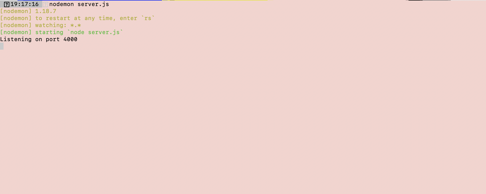
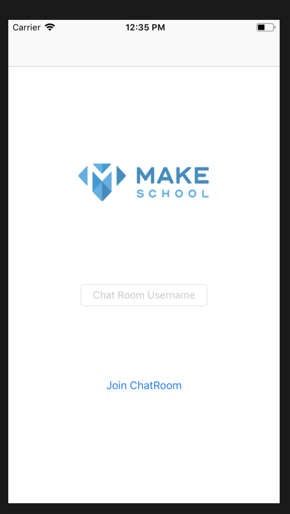
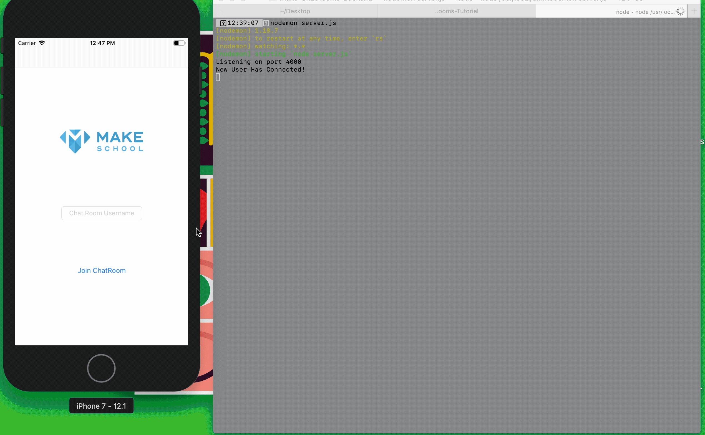

# It's about that time to start coding! 

Now that we have we a basic understanding of how web sockets work lets proceed to see them! If you navigate to this projects backend that can be found [here](https://github.com/Make-School-Labs/Make-ChatRooms-Backend) or in the root README in the installation portion!

Once you have your node server up and running feel free to analyze the source code or a more guided approach as we progress through the tutorial!

The output you should see upon successfully running your node server is this.



Now that we have a functional server up and running lets starting making a functional client to match!

Throughout the development of this project we are going to be using top-down development in which we build components that the user directly interacts with first and boil down to the implementation details which is our code.

For example if we have view that takes user input and displays it in a label. We will first make the visual components then add the functionality to send that input to the label. This process allows us to map out plans for development by changing your perspective to be that of the user!

The first component of the application is to be able for a user to connect to our server. This in terms of the application itself is when users first enters the chat.

When done with this component our intial screen will look like this!


Since we are adopting a top-down approach lets proceed to making our first xib file that will be in charge of taking the user's username and join the chat room.

If you navigate through the starter kit project contained in this project's repo you'll see a views folder. Lets create a new file called **CreateUserView.xib**

Create three components on the view:

1. UIImageView
2. Text Field(Placeholder text optional of "Chat Room Username") 
3. And a button("Text optional of "Join ChatRoom")


If done correctly, it should resemble the image up above!

Now that we have created our visual components let us connect that to our code so we can manipulate these elements. Proceed to make the corresponding swift file for our xib view if you haven't done so already.

Once you have created your file for your view the starting contents should look like this *Arrow down

[action]
``` swift
    class CreateUserView: UIView {
        override init(frame: CGRect) {
            super.init(frame: frame)
        }

        required init?(coder aDecoder: NSCoder) {
            super.init(coder: aDecoder)
        }
    }
```

Inside lets create a function that is in charge of initializing the view when called from the parent view controller. This allows us to be able to configure this view no matter where its called. Add this function to our View

[action]
``` swift
      private func commonInit() {
        
        // When this function is executed it will load the corresponding xib file
        Bundle.main.loadNibNamed("CreateUserView", owner: self, options: nil)

        // Add this view to the main view with added configurations
        addSubview(userInfoView)
        userInfoView.autoresizingMask = [.flexibleWidth, .flexibleHeight]
    }

    // Now that we have made this helper function it still has to be executed lets call it in the intializer

     override init(frame: CGRect) {
            super.init(frame: frame)
            commonInit()
        }

```

Now that we have the corresponding swift file we can connect our UIElements to code!

[solution]
``` swift

class CreateUserView: UIView {
    ... // You'll see these three dots throughout the tutorial meaning that we are adding code!

    @IBOutlet weak var userInfoView:UIView!
    @IBOutlet weak var makeSchoolLogoImageView: UIImageView!
    @IBOutlet weak var userNameTextField: UITextField!
   
    @IBAction func joinChatRoomButton(_ sender: Any) {
        guard let username = userNameTextField.text else {return}
     
    }
}

```
We are going to need to make a view contoller to house our CreateUserView.

Lets create view controller called CreateUserViewController, which should be created under our controllers folder.

[action]
``` swift
class CreateUserViewController : UIViewController {

    override func viewDidLoad() {
        super.viewDidLoad()
    }
}
```

Since our view should only contain logic pertaining to the view let's instatiate the chat room inside our CreateUserViewController 


Great! Lets now run the program ... oh shoot there is a black screen!

The reason being is that we haven't set our root view controller, take a minute to set our root view controller to be the CreateUserViewController

[solution] 
``` swift
func application(_ application: UIApplication, didFinishLaunchingWithOptions launchOptions: [UIApplicationLaunchOptionsKey: Any]?) -> Bool {
        // Override point for customization after application launch.
        
        window = UIWindow(frame: UIScreen.main.bounds)
        window?.makeKeyAndVisible()
        
        
        let createUserVC = CreateUserViewController()
        
        window?.rootViewController = UINavigationController(rootViewController: createUserVC)
        return true
    }

```

[solution]
``` swift
override func viewDidLoad() {
        super.viewDidLoad()
        let createUserView = CreateUserView()
        createUserView.frame = self.view.bounds
        self.view.addSubview(createUserView)
 }
```


Wait! There is still a problem here, when we press the join chat room button nothing happens ... so I guess the appropriate question is what should happen!


When the user joins the chat room server we want to notify our server that we have a new user!

#### When we implement our socket functionality!



We will get there first we have to model attributes relating to the user ... we first have to model our domain. Stay tuned!
