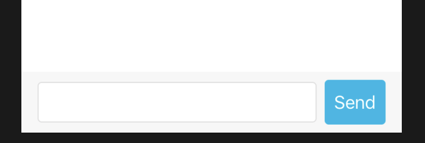
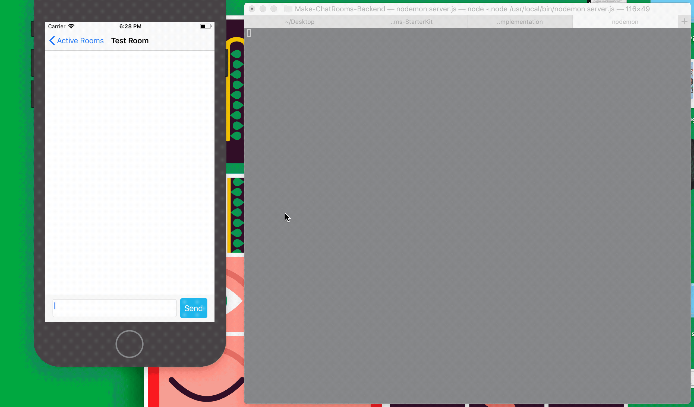

## Creating a Chat Room Interface

We have finally made it to the last step in the tutorial. In this portion of the tutorial we are going to be creating our chat interface so we can send and receive messages to and from users.


First lets create a message input view that is in charge of extracting user input and directing it to our controller logic.


This is what the finished component will look like.

Take a moment to create a MessageInputView file inside our views folder.

Here is some starter code to create our messaging view.

[action]
``` swift
class MessageInputView: UIView{
    
    
    // Instantiating text view responsible for typing the message
    let textView = UITextView()
    let sendButton = UIButton()
    
    override init(frame: CGRect) {
        super.init(frame: frame)
        
       configureViews()
    }
    
    required init?(coder aDecoder: NSCoder) {
        fatalError("init(coder:) has not been implemented")
    }
    
    
    @objc func sendTapped() {
        // Reset the text view when the sender triggers the protocol function
        guard let messsage = textView.text else {return}
        print("User has typed in the message \(String(describing: message))")
    }
    
    override func layoutSubviews() {
        super.layoutSubviews()
        
        let size = bounds.size
        textView.bounds = CGRect(x: 0, y: 0, width: size.width - 32 - 8 - 60, height: 40)
        sendButton.bounds = CGRect(x: 0, y: 0, width: 60, height: 44)
        
        textView.center = CGPoint(x: textView.bounds.size.width/2.0 + 16, y: bounds.size.height/2.0)
        sendButton.center = CGPoint(x: bounds.size.width - 30 - 16, y: bounds.size.height/2.0)
        
    }
    
    func configureViews() {
        
        // Initalize layout of the the send button and the text view
        backgroundColor = UIColor(red: 247/255, green: 247/255, blue: 247/255, alpha: 1.0)
        textView.layer.cornerRadius = 4
        textView.layer.borderColor = UIColor(red: 200/255, green: 200/255, blue: 200/255, alpha: 0.6).cgColor
        textView.layer.borderWidth = 1
        
        sendButton.backgroundColor = UIColor(red: 8/255, green: 183/255, blue: 231/255, alpha: 1.0)
        sendButton.layer.cornerRadius = 4
        sendButton.setTitle("Send", for: .normal)
        sendButton.isEnabled = true
        
        sendButton.addTarget(self, action: #selector(MessageInputView.sendTapped), for: .touchUpInside)
        
        addSubview(textView)
        addSubview(sendButton)
    }
}

extension MessageInputView: UITextViewDelegate {
    func textViewShouldEndEditing(_ textView: UITextView) -> Bool {
        return true
    }
}

```

Now that we have created our view, we need to create a controller that is going to house the logic between our view and our other logic.

Take a moment to create a ChatRoomViewController inside our controllers folder

[action]
``` swift
    class ChatRoomViewController: UIViewController {

    let tableView = UITableView() // The messages are going to be organized using a UITableView
    
    // Instantiate the message input view that adds itself as a subview
    let messageInputBar = MessageInputView()
    
    var messages = [Message]()
    
    override func viewWillAppear(_ animated: Bool) {
        super.viewWillAppear(true)
    }
    
}

```
We are using a table view to display the messages in rows. In our helpers folder lets **uncomment the logic in ChatRoomExtension.swift**. This file is responsible for the boilerplate code that goes into designing our chat interface. We will be referencing this file throughout the rest of the tutorial.

Great! Now that we have created a controller that instantiates our message input view lets run it. There is still one small problem though, there is no way to get to this view.

If we go back to our didSelectRowAt method inside our RoomsTableViewController lets add the logic to transition to our ChatRoom.


``` swift
override func tableView(_ tableView: UITableView, didSelectRowAt indexPath: IndexPath) {
        let chatRoomViewController = ChatRoomViewController()
        self.navigationController?.pushViewController(chatRoomViewController, animated: true)
    }

```

Now try running the program and entering a message ... you should see the print statement that outputs the message that the user wants to send.

Take a break you deserve it! The next step is to notify our controller that the user has sent a message and emit the corresponding event to our server.

To notify our controller that the user pressed send from the Message Input View we need to create a protocol in order to do this.

Take a moment to create a protocol and a skeletal function in charge of notifying the controller that the send button was tapped.

[solution]
``` swift

// In charge of notifying the controller and relaying the message to be sent over the socket connection!
protocol MessageInputDelegate: class {
    func sendWasTapped(message: String)
}
```

Now that we have created the protocol lets take a moment to add a delegate to our delegator and execute the sendWasTapped method.

[solution]
``` swift
     @objc func sendTapped() {
        // Reset the text view when the sender triggers the protocol function
        guard let messsage = textView.text else {return}
        textView.text = "" // Reset the text field after user sends a message
        
        delegate?.sendWasTapped(message: messsage)
    }
```

Now that we have implemented the delegator side of the equation lets make our controller conform to our new protocol. Through separation of concerns lets put this file inside the extensions folder.

``` swift
extension ChatRoomViewController : MessageInputViewDelegate {
        func sendWasTapped(message: String) {
            // In charge of triggering our chat message event emitter and configuring table view to show newly made message
    }
}
```

Did you remember to also mark the receiver of the Chat Room delegate as self?

[solution]
``` swift
    class ChatRoomViewController : UIViewController {
        ...
        override func viewWillAppear(_ animated: Bool) {
            ...
            ChatRoom.shared.delegate = self
        }
    }
```

Take a moment to trigger our send message method inside our ChatRoom with the given message contents. To do so we need to formulate our message object. 

We currently have a blocker ... we have no access to the room name that the user is currently in!

Take a moment to find a way to transmit the room name from when the user selects the room cell they want to enter to be able to parse the name inside our message object in the ChatRoomViewController.

[solution]
``` swift
    override func tableView(_ tableView: UITableView, didSelectRowAt indexPath: IndexPath) {
        let chatRoomViewController = ChatRoomViewController()
        chatRoomViewController.roomName = SharedUser.shared.user?.activeRooms?[indexPath.row].roomName ?? "Empty Room"
        self.navigationController?.pushViewController(chatRoomViewController, animated: true)
    }

    class ChatRoomViewController : UIViewController {
        ... 
        var roomName = ""
    }
```

Now that we have access to the last missing attribute inside our message object lets continue to formulate it  and send it to our chat room logic.

Your sendWasTapped method should now look like this.

[info]
``` swift
    ...
    func sendWasTapped(message: String) {
        let userDefaults = UserDefaults()
        guard let username = userDefaults.value(forKey: "username") else {return}
        print("Sent Message \(message)")
        let messageObject = Message(messageContent: message, senderUsername: username as! String, messageSender: true, roomOriginName: self.roomName)
        ChatRoom.shared.sendMessage(message: messageObject)       
    }
```

Great! Lets run the code now. When you press send it should emit the message event to our server ... but nothing shows up on the screen lets fix that!



First we are going to need to create an array that is going to store our message objects.
Take a moment to add a messages array to our ChatRoomViewController.

[action]
``` swift
    class ChatRoomViewController : UIViewController {
        ... 
        var messages = [Message]()
        ...
    }
```

Lets create a new file that is composed of the ChatRoomViewController that conforms to the data source and delegate of the UITableView. Inside extensions lets make a new file called
**ChatRoomViewController+TableViewController.swift**. 

Take a moment to configure this extension to conform to our table view data source and delegate

[solution]
``` swift

extension ChatRoomViewController: UITableViewDataSource, UITableViewDelegate {
    // Extension of the ChatRoomView Controller to configure Table View
    
    func tableView(_ tableView: UITableView, cellForRowAt indexPath: IndexPath) -> UITableViewCell {
    }
    
    func tableView(_ tableView: UITableView, numberOfRowsInSection section: Int) -> Int {
        // Return the number of cells corresponding to the number of messages we currently have
        return messages.count
    }
    
    func numberOfSections(in tableView: UITableView) -> Int {
        return 1
    }
    
    func tableView(_ tableView: UITableView, heightForRowAt indexPath: IndexPath) -> CGFloat {
    }
    
}
```
Now that we have the proper methods corresponding to our table view lets add some functionality. 

Let's implement a helper method that allows us to insert a message cell into the view without having to reload the table view. For example if every time you sent a message to someone the whole screen reloaded that would get quite annoying.

Let's add the insertNewMessageCell method to our ChatRoomViewController extension.

[action]
``` swift

extension ChatRoomViewController: UITableViewDataSource, UITableViewDelegate {
    func insertNewMessageCell(_ message: Message) {
        messages.append(message)
        let indexPath = IndexPath(row: messages.count - 1, section: 0)
        
        // Able to do an animation of inserting without needing to reload
        tableView.beginUpdates()
        tableView.insertRows(at: [indexPath], with: .bottom)
        tableView.endUpdates()
        tableView.scrollToRow(at: indexPath, at: .bottom, animated: true)
    }
}

```

Great! We are one step closer to visually outputting our messages inside our chat interface.

Now that we have appended that message to our messages array we want to be able to apply those contents to our cell in each row.

To do this we are first going to need to create a custom Table View Cell, I called mine **MessageTableViewCell**. This cell is going to be in charge of displaying our message contents and other corresponding information.

Concerning the layout of our chat interface, credit is all given to the [ray wenderlich tutorial for creating a chat application](https://www.raywenderlich.com/537-real-time-communication-with-streams-tutorial-for-ios). The logic we are directly concerned with is the layout of our messages depending of who the message sender is.

[info]
``` swift
class MessageTableViewCell: UITableViewCell {
    //    var messageSender: MessageSender = .ourself
    let messageContentLabel = UILabel()
    let nameLabel = UILabel()
    var message: Message?
    
    func apply(message: Message) { // When applying a message to the cell update below information
        self.message = message
        nameLabel.text = message.senderUsername
        messageContentLabel.text = message.messageContent
        setNeedsLayout()
    }
    
    override init(style: UITableViewCellStyle, reuseIdentifier: String?) {
        super.init(style: style, reuseIdentifier: reuseIdentifier)
        messageContentLabel.clipsToBounds = true
        messageContentLabel.textColor = .white
        messageContentLabel.numberOfLines = 0

        nameLabel.textColor = .lightGray
        nameLabel.font = UIFont(name: "Helvetica", size: 10)

        clipsToBounds = true
        addSubview(messageContentLabel)
        addSubview(nameLabel)
    }
    
    required init?(coder aDecoder: NSCoder) {
        fatalError("init(coder:) has not been implemented")
    }
    
    
    // Measurements and layout for messages
    private class func height(forText text: String, fontSize: CGFloat, maxSize: CGSize) -> CGFloat {
        let font = UIFont(name: "Helvetica", size: fontSize)!
        let attrString = NSAttributedString(string: text, attributes:[NSAttributedStringKey.font: font,
                                                                      NSAttributedStringKey.foregroundColor: UIColor.white])
        let textHeight = attrString.boundingRect(with: maxSize, options: .usesLineFragmentOrigin, context: nil).size.height
        
        return textHeight
    }
    
    class func height(for message: Message) -> CGFloat {
        let maxSize = CGSize(width: (UIScreen.main.bounds.size.width/3), height: CGFloat.greatestFiniteMagnitude)
        
        let nameHeight = height(forText: message.senderUsername, fontSize: 10, maxSize:maxSize)
        let messageHeight = height(forText: message.messageContent, fontSize: 17, maxSize: maxSize)
        
        return nameHeight + messageHeight + 32 + 16
    }
}


```

Take a moment to create your Table View Cell. Here is some boilerplate code concerning the layouts of our table view cells. Additionally, lets uncomment the layout logic inside our MessageTableViewCell extension file in the extensions folder. 

Now that we have created and configured our Message Table View cell lets refactor the cell for row at method inside our Chat Room View controller table view extension file!

Take a moment to call the apply method on our message table view cell with the corresponding message from the messages array.

[solution]
``` swift

extension ChatRoomViewController: UITableViewDataSource, UITableViewDelegate {
    // Extension of the ChatRoomView Controller to configure Table View
    
    ...
    func tableView(_ tableView: UITableView, cellForRowAt indexPath: IndexPath) -> UITableViewCell {
        let cell = MessageTableViewCell(style: .default, reuseIdentifier: "MessageCell") 
        cell.selectionStyle = .none
        
        let message = messages[indexPath.row]
        cell.apply(message: message)
        
        return cell
    }
```

We can now call our insertMessageCell method inside of our sendWasTapped Method.

[action]
``` swift
extension ChatRoomViewController: MessageInputDelegate {
    func sendWasTapped(message: String) {
        ...
        insertNewMessageCell(messageObject)
       
    }
}
```

Great! Lets run our program. Now when you send a message you should see a green message bubble inserted! 


#### Insert GIF here

You'll notice that when another user connected to the same room messages us we don't see a chat bubble inserted. Thats because we are only inserting a message cell when we send a message. Lets implement one of the final functionalities, inserting a message cell when we receive a message.

We will need to make a protocol to alert our ChatRoomViewController that we have received a message.

Lets add a RecievedMessage protocol to our protocols file.

[solution]
``` swift
protocol ReceivedMessage: class {
    func receivedMessage()
}
```
When we receive a message our event listener **chat message** is triggered, lets **decode** the incoming data into our Message model that we have made. Once you have done so lets trigger our received message delegate with the newly decoded message object.

[solution]
``` swift 
class ChatRoom {
        ...
        var receivedMessageDelegate: ReceivedMessage?

        func eventListeners() {
            ...
            socket.on("chat message") { (data, ack) in
                guard let message = try? JSONDecoder().decode(Message.self, from: data[0] as! Data) else {return}
                self.receivedMessageDelegate?.recievedMessage(message: message)
        }
    }
}
```

Take a moment to create an extension of our ChatRoomViewController that conforms to our newly created protocol.

[action]
``` swift
    extension ChatRoomViewController: ChatRoomDelegate {
    
    func recievedMessage(message: Message) {
        message.messageSender = false // Will always be false due to us broadcasting messages ... therefore if we receive a message we couldn't have possibly sent it.
        
        // If we are connected to multiple rooms we only want to display messages that are being sent to the current room we are visually in!
        if message.roomOriginName == self.roomName {
            insertNewMessageCell(message)
        }
        
    }
}
```

1. We are setting our message sender to false due to our logic contained inside the MessageTableViewCell extension file

    - ``` swift
        ... 
         //ACTION: Set the right color and position for each message depending on whos the sender
            if self.message?.messageSender == true {
                nameLabel.isHidden = true
                
                messageContentLabel.center = CGPoint(x: bounds.size.width - messageContentLabel.bounds.size.width/2.0 - 16, y: bounds.size.height/2.0)
                messageContentLabel.backgroundColor = UIColor(red: 24/255, green: 180/255, blue: 128/255, alpha: 1.0)
            } else {
                nameLabel.isHidden = false
                nameLabel.sizeToFit()
                nameLabel.center = CGPoint(x: nameLabel.bounds.size.width/2.0 + 16 + 4, y: nameLabel.bounds.size.height/2.0 + 4)
                
                messageContentLabel.center = CGPoint(x: messageContentLabel.bounds.size.width/2.0 + 16, y: messageContentLabel.bounds.size.height/2.0 + nameLabel.bounds.size.height + 8)
                messageContentLabel.backgroundColor = .lightGray
            }
            
        }
    ```

2. Based off the message sender we know how to configure the message cell correctly ... this will result in a gray message bubble being inserted as opposed to a green message bubble when we are the message sender.


Great! Now we are able to send and receive messages through our interface! The rest of the tutorial contains stretch challenges and possible refactorings that can be made!